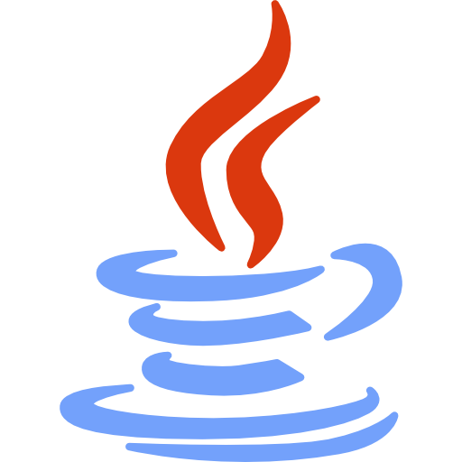
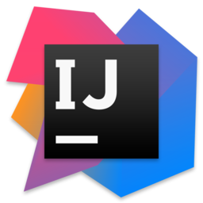

# Hello!  
### Something about me 
I am Software Developer I love programming I started as a kid making my first program with cpp I was interested in programs that just controlled my own computer at low level after that I was interested in games and servers after that I got into PHP, JS HTML and CSS as part of web dev after that I replaced php with C# and fell in love with OOP.
### My touch with programming
I am passionate about programming due to how I can automatize things and make machines do something for me I love technologies that make my life easier mainly due to how these can help me advance with my projects a lot faster I also like to do some frameworks of my own to ease the repetetive processes
## Languages i love using and technologies I'm fluent with ❤️
<!-- ADVANCED_TECH -->
+ 
+ 
+ 
+ 
+ 

<!-- ADVANCED_TECH_END -->

## Technologies I alerady have had contact with
<!-- TECH_DISPLAY -->

